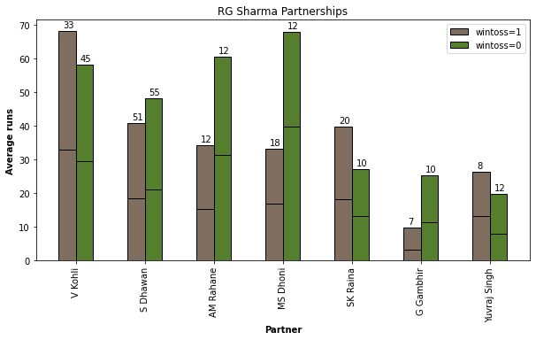
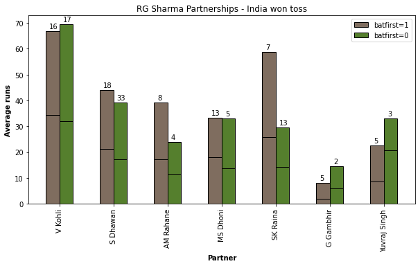
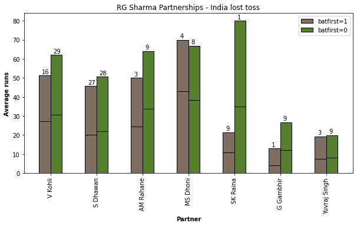
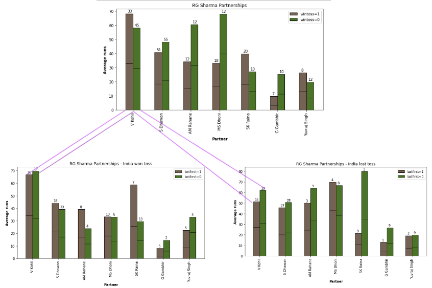
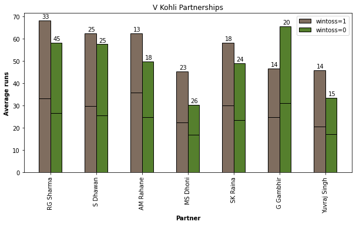

# Analysis of batting partnerships of RG Sharma and Virat Kohli :cricket_game:

**Goal of analysis**

We'll look at the partnerships of the 2 top batsmen in Indian cricket and possibly in the world. Are they able to bat together as well or even better than they do with the other batters in the team? 

Do they bat better in the first innings or while chasing a target?

** [Data source](https://cricsheet.org/format/) **

<!-- 

 -->

